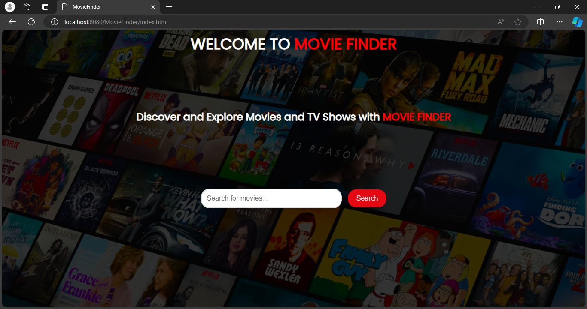
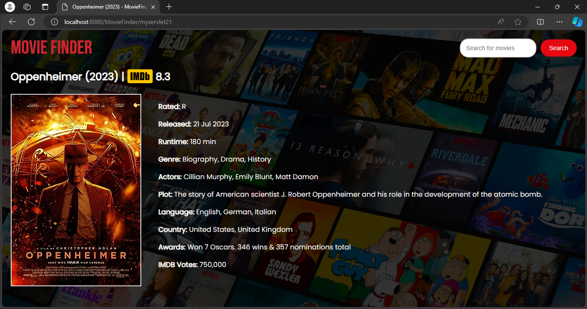
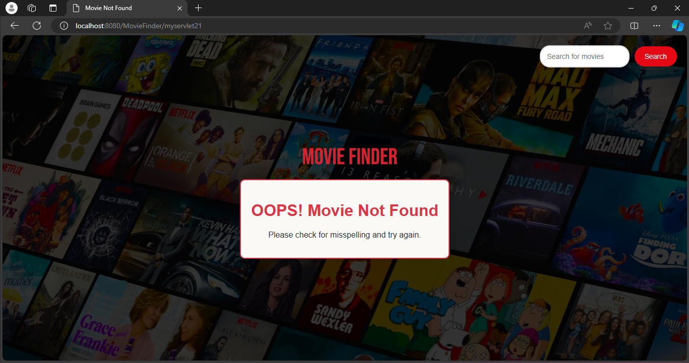

# Movie Finder

Movie Finder is a site where you can search for any movie to get detailed information including plot summaries, cast and crew details, ratings, reviews, and much more, all powered by IMDb. Whether you're looking for the latest releases, timeless classics, or trending shows, MovieFinder has got you covered.

## Features

- **Search for Movies and TV Shows**: Find detailed information on a vast array of movies and TV shows.
- **Detailed Information**: Get information such as plot summaries, cast details, ratings, and more.
- **User-Friendly Interface**: Navigate easily through a clean and intuitive interface.

## Technology Stack

- **Java**: The core logic of the application is implemented in Java.
- **OMDB API**: Movie and TV show data are fetched using the OMDB API.
- **Apache Tomcat**: The website runs on an Apache Tomcat server.
- **JSP/Servlets**: Used for dynamic web content.

## Installation

1. Clone the repository:
    ```sh
    git clone https://github.com/ashutoshh-17/MovieFinder.git
    ```

2. Open your preferred IDE (such as Eclipse or IntelliJ IDEA) and import the project.

3. Configure your Apache Tomcat server in the IDE and add the project to the server.

4. Build and deploy the project on the Tomcat server.

5. Start the Tomcat server.

6. Open a web browser and navigate to:
    ```
    http://localhost:8080/MovieFinder
    ```

## Usage

1. Clone the repository
2. Set up Apache Tomcat
3. Deploy the project on the server
4. Open your browser and go to the deployed address
5. Enter a movie name and hit search to see the details
   
## Screenshots

*Home Page*


*Search Results*


*Movie Not Found*


## Contributors

- [ashutoshh-17](https://github.com/ashutoshh-17)
- [ACEGX25](https://github.com/ACEGX25)
- Contributions are welcome! Please open an issue or submit a pull request on GitHub.

## License

This project is licensed under the MIT License. See the [LICENSE](LICENSE) file for more details.

## Contact

Created by [ashutoshh-17](https://github.com/ashutoshh-17) - feel free to contact me!  
